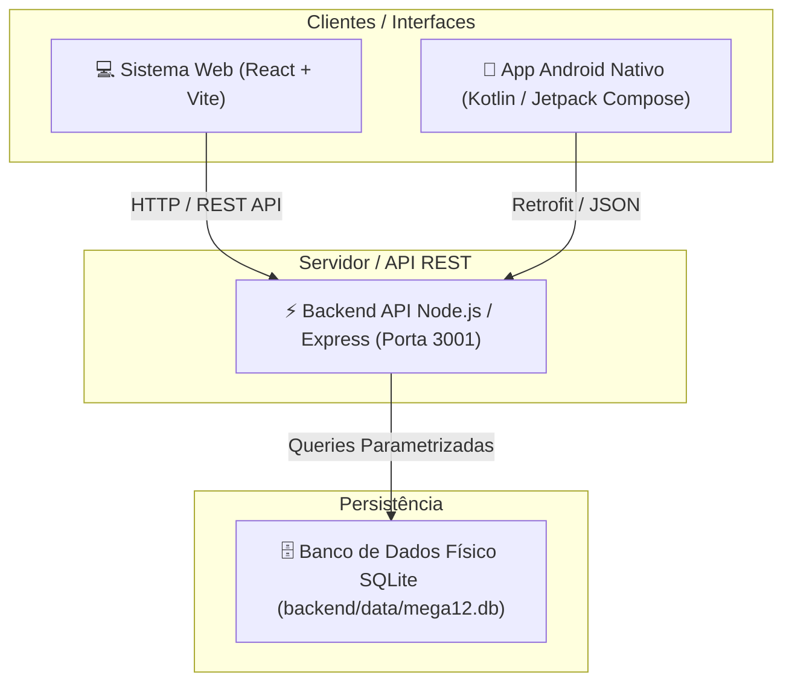

# 🚀 GUIA COMPLETO DE IMPLANTAÇÃO - ECOSSISTEMA REDE MEGA 12

> **Documento de Implantação e Operação do Sistema de Compras, Separação & Doca e Aplicativo Android Nativo da Rede Mega 12.**  
> Este guia abrange a instalação, configuração, compilação e deploy do **Backend Node.js (API + SQLite)**, do **Sistema Web (React + Vite)** e do **Aplicativo Mobile Nativo (Kotlin + Jetpack Compose)**.

---

## 📐 1. Arquitetura Geral do Ecossistema

O ecossistema é composto por 3 camadas integradas:



---

## 📋 2. Pré-requisitos de Sistema

### 🛠️ Para o Servidor Web / API (Backend)
- **Node.js**: Versão 18.x LTS ou 20.x LTS ([nodejs.org](https://nodejs.org)).
- **NPM**: Versão 9.x ou superior.
- **Sistema Operacional**: Windows 10/11, macOS ou Linux (Ubuntu/Debian).

### 📱 Para o Aplicativo Android Nativo
- **Android Studio**: Versão 2024.1+ (Ladybug / Jellyfish ou superior).
- **JDK**: Java Development Kit 17.
- **Android SDK**: Compile SDK 35, Target SDK 35, Min SDK 26 (Android 8.0 Oreo ou superior).
- **Dispositivo**: Emulador Android Virtual Device (AVD) ou Smartphone Android via Depuração USB.

---

## 💻 3. Implantação Local / Desenvolvimento (Servidor + Web + App)

### Passo 1: Inicialização do Servidor & Sistema Web Local

Você pode iniciar o servidor e a interface web com **um único clique**:

#### No Windows:
Dê um duplo clique no arquivo:
```cmd
iniciar_servidor.bat
```

#### No macOS ou Linux:
Execute no terminal:
```bash
chmod +x iniciar_servidor.sh
./iniciar_servidor.sh
```

> **O que o inicializador faz automaticamente:**
> 1. Verifica se o Node.js está instalado.
> 2. Instala as dependências de `backend/` e `web/` caso ainda não existam.
> 3. Sobe o **Backend Node.js** na porta `3001`.
> 4. Sobe o **Frontend Web (Vite)** na porta `5173`.
> 5. Abre automaticamente o navegador padrão em `http://localhost:5173`.

---

## 🌐 4. Implantação do Servidor em Nuvem / Produção (Render, Docker ou VPS)

Para colocar o sistema web e a API disponíveis 24/7 na internet para os compradores e conferentes:

### Opção A: Deploy Unificado no Render.com (ou Heroku / Railway)
O arquivo [`render.yaml`](file:///c:/Users/Josu%C3%A9/Documents/App%20Rafael/render.yaml) já está configurado no projeto:

1. Acesse o [Render.com](https://render.com) e conecte o repositório do Git.
2. Crie um **Web Service** selecionando o ambiente `Node`.
3. Configure os comandos:
   - **Build Command:**
     ```bash
     cd backend && npm install && cd ../web && npm install && npm run build
     ```
   - **Start Command:**
     ```bash
     cd backend && npm start
     ```
4. O servidor Node.js servirá tanto a API quanto a interface Web em uma única URL segura HTTPS.

### Opção B: Deploy em Servidor VPS (Ubuntu + Nginx + PM2)
1. Clone o repositório na VPS:
   ```bash
   git clone <URL_DO_REPOSITORIO>
   cd "App Rafael"
   ```
2. Instale dependências e faça o build do frontend:
   ```bash
   cd web && npm install && npm run build && cd ..
   cd backend && npm install
   ```
3. Inicie a API com **PM2**:
   ```bash
   npm install -g pm2
   pm2 start server.js --name "mega12-backend"
   pm2 save
   pm2 startup
   ```

---

## 📱 5. Compilação, Configuração e Deploy do App Android Nativo

### Passo 1: Abrir o Projeto no Android Studio
1. Abra o **Android Studio**.
2. Clique em **File > Open...** e escolha a pasta do app:
   ```text
   c:\Users\Josué\Documents\App Rafael\android_app
   ```
3. Aguarde o Android Studio baixar as dependências e realizar o *Gradle Sync*.

### Passo 2: Configuração do Endereço do Servidor (API IP)

O aplicativo Android possui uma tela nativa para alteração do IP do servidor sem necessidade de recompilar o código:

- **Se usar o Emulador Android Studio:** O IP padrão do computador hospedeiro é `http://10.0.2.2:3001/api/`.
- **Se usar um Celular Físico via Wi-Fi:** Informe o IP da máquina na rede local (ex: `http://192.168.1.100:3001/api/`).
- **Se o Servidor estiver na Nuvem (Render/VPS):** Informe a URL pública da API (ex: `https://mega12-api.onrender.com/api/`).

Você pode alterar essa URL dentro do próprio app acessando:
`Menu > Configuração do Servidor > URL Base da API`.

### Passo 3: Geração do Arquivo Instalação (APK)

#### Para Testes / Instalação Direta no Celular (APK Debug/Release):
1. No Android Studio, vá ao menu superior:
   `Build > Build Bundle(s) / APK(s) > Build APK(s)`
2. O arquivo gerado estará localizado em:
   ```text
   android_app/app/build/outputs/apk/debug/app-debug.apk
   ```
3. Transfira o arquivo `.apk` para o celular via WhatsApp, E-mail ou cabo USB e toque para instalar.

#### Para Distribuição Oficial em Loja (App Bundle - AAB):
1. Vá ao menu: `Build > Generate Signed Bundle / APK...`
2. Selecione **Android App Bundle (.aab)**.
3. Escolha a Chave de Assinatura (*Keystore*) do projeto e conclua a geração.

---

## 🔑 6. Credenciais e Perfis de Acesso Padrão (RBAC)

O sistema possui 4 níveis de permissão estritamente isolados:

| Perfil / Cargo | E-mail Padrão | Senha Padrão | Acesso e Permissões |
| :--- | :--- | :--- | :--- |
| **👑 Diretoria / Admin** | `diretoria@mega12.com.br` | `123456` | **Acesso Total:** Todas as páginas, margens de lucro, BI, financeiro, fiscal e gestão de usuários. |
| **🛒 Comprador** | `compras@mega12.com.br` | `123456` | **Compras & Cotações:** Cotações, catálogo, fornecedores, histórico e app de viagens. |
| **📦 Conferente de Doca** | `separacao@mega12.com.br` | `123456` | **Doca & Romaneios:** Rateio das 20 lojas, conferência de caixas e registro de avarias *(sem acesso a margens/custos)*. |
| **🏭 Depósito / CD** | `deposito@mega12.com.br` | `123456` | **Estoque CD:** Posição do galpão, ajuste de saldo e ordens de transferência para lojas. |

---

## 💾 7. Backup e Manutenção do Banco de Dados SQLite

O banco de dados SQLite é armazenado em um único arquivo físico:
```text
backend/data/mega12.db
```

### Procedimento de Backup Recomendado:
1. Para realizar backup dos dados, basta copiar o arquivo `mega12.db` para um diretório seguro, drive em nuvem ou HD externo.
2. Para restaurar, substitua o arquivo `mega12.db` no caminho `backend/data/` com o servidor parado e reinicie a API.

---

## 🛠️ 8. Resolução de Problemas Comuns (Troubleshooting)

### 1. "O App Android não conecta no servidor"
- **Causa:** O celular ou emulador não consegue alcançar o IP configurado.
- **Solução:**
  - Se for celular físico, garanta que ele e o computador estejam conectados na **mesma rede Wi-Fi**.
  - No Windows, verifique se o Firewall não está bloqueando a porta `3001`.
  - No App, acesse a tela *Configuração do Servidor* e teste a conexão.

### 2. "Erro de permissão no script de inicialização (macOS/Linux)"
- **Solução:** Dê permissão de execução com o comando:
  ```bash
  chmod +x iniciar_servidor.sh Iniciar_Mega12.command
  ```

### 3. "Conflito de porta 3001 ou 5173 ocupada"
- **Solução:** Feche outros processos Node.js ativos ou altere a variável `PORT` no arquivo `.env` da pasta `backend/`.

---

## 🛡️ 9. Conformidade com as Diretrizes do Projeto (AGENTS.md)

Toda a implantação e código do projeto respeitam os pilares estipulados no [AGENTS.md](file:///c:/Users/Josu%C3%A9/Documents/App%20Rafael/AGENTS.md):
- **Security by Design:** Autenticação via JWT, criptografia de senhas com bcrypt, queries parametrizadas anti-SQL Injection no SQLite e sanitização dos dados.
- **Clean Architecture:** Isolamento estrito de regras de negócio (Motores Fiscais e de Separação), independência de UI e tratamento centralizado de exceções.
